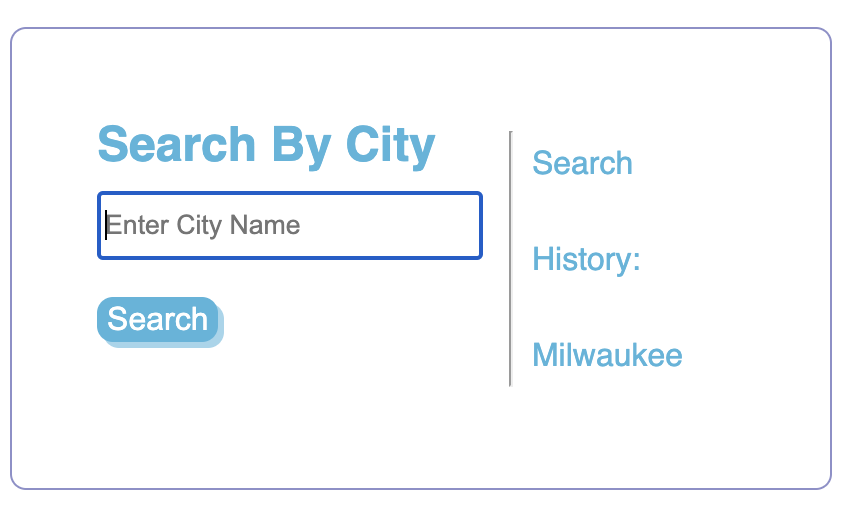
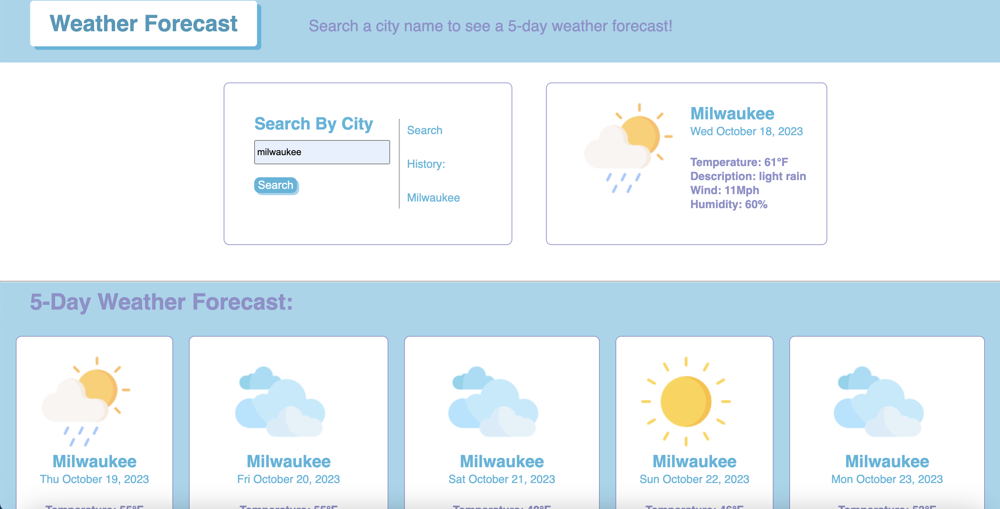

# 06 Server-Side APIs: Weather Dashboard

## Description

This challenge is to create a weather forecast to show the current forecast as well as the forecast for the next 5-days when a user types in a city name. Once a user search a city name, they are then shown the temperature, description of the weather, wind speed, and humidity for that day and the next 5 consecutive days.

## User Story

```
AS A traveler
I WANT to see the weather outlook for multiple cities
SO THAT I can plan a trip accordingly
```

## Acceptance Criteria

```
GIVEN a weather dashboard with form inputs
WHEN I search for a city
THEN I am presented with current and future conditions for that city and that city is added to the search history
WHEN I view current weather conditions for that city
THEN I am presented with the city name, the date, an icon representation of weather conditions, the temperature, the humidity, and the wind speed
WHEN I view future weather conditions for that city
THEN I am presented with a 5-day forecast that displays the date, an icon representation of weather conditions, the temperature, the wind speed, and the humidity
WHEN I click on a city in the search history
THEN I am again presented with current and future conditions for that city
```


## Usage

When a user types a city name and click on the search button, their input will be saved into the local storage so that the user can see which cities they previously searched.

Live site: https://bxiong34.github.io/weather-forecast/




- - -
© 2023 Bao Xiong. All Rights Reserved.
